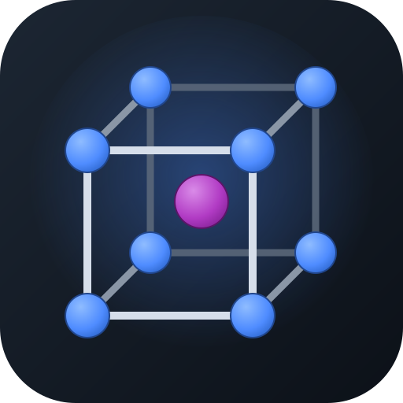

# LatticeLab

**Malzeme Biliminin Temelleri** için 3 boyutlu, etkileşimli bir öğrenme aracı.
Kristal yapıları, **Miller düzlemlerini (hkl)** ve **doğrultularını [uvw]** telefon,
tablet ve bilgisayarda görselleştirir; LAY/DAY/APF hesaplarını adım adım gösterir.

<br clear="left">

> Metalurji ve Malzeme Mühendisliği öğrencileri için hazırlanmıştır.
> Türkçe ve İngilizce dil desteği vardır.

---

## 📲 İndir ve Kur

En güncel sürümü **[Releases](../../releases/latest)** sayfasından indirebilirsin:

| Platform | Dosya | Kurulum |
|---|---|---|
| **Android** (telefon/tablet) | `LatticeLab.apk` | İndir → "bilinmeyen kaynaklara izin ver" → kur |
| **Windows** (PC) | `LatticeLab-Setup.exe` | İndir → çalıştır → kur |

> Güncellemeler aynı imza ile yayınlandığı için Android'de **eskiyi silmeden**
> üzerine kurulur.

---

## ✨ Özellikler

**Kristal yapılar (3B, döndür–yakınlaştır):**
- **Saf metaller:** BK (Basit Kübik), HMK (HMK/BCC), YMK (YMK/FCC), HSP (HSP/HCP)
- **Bileşikler:** NaCl, CsCl, ZnS, CaF₂ 

**Miller indisleri:**
- **Düzlemler (hkl):**
  Negatif indiste orijin otomatik kaydırılır; düzlemler arası mesafe (d) gösterilir.
- **Doğrultular [uvw]:** kübik 3-indis ve HSP 4-indis `[uvtw]` (otomatik dönüşüm).
- Eksenler hücre dış hattından **farklı renkte:** kübikte x–y–z, HSP'de a1–a2–a3–c
  (c ekseni dik, standart görünüm).

**Hesaplamalar (formül + sonuç, a ve r cinsinden):**
- **LAY** — Lineer Atom Yoğunluğu
- **DAY** — Düzlemsel Atom Yoğunluğu
- **APF/ADF** — Atomik Dolgu Faktörü

**Bileşiklerde:** tetrahedral / oktahedral / kübik **boşluk** ve **koordinasyon**
açıklamaları.

**Diğer:** top–çubuk / dolu (temas eden atom) görünümü, atom/eksen/hücre aç-kapa,
dokunmatik kontroller, ⚙ Ayarlar'da dil ve iletişim.

---

## 🧮 Doğruluk

Hesaplar bilinen değerlerle doğrulanmıştır; örn. **YMK [110] LAY = 0,5/r** ve
**YMK (111) DAY = 0,289/r²** (Callister ile uyumlu).

---

## 🛠️ Geliştirme

```bash
npm install
npm run dev        # tarayıcıda geliştirme (http://localhost:5173)
npm run build      # web çıktısı -> dist/
```

**Teknoloji:** [Three.js](https://threejs.org) (3B) + [Vite](https://vitejs.dev)
(paketleme) + [Capacitor](https://capacitorjs.com) (Android) +
[Electron](https://electronjs.org) (Windows).

### Android APK derleme
```bash
npm run build
npx cap sync android
cd android && ./gradlew assembleRelease
# Çıktı: android/app/build/outputs/apk/release/app-release.apk
```

### Windows .exe derleme
```bash
npm run electron:build      # dist-electron/ içine kurulum .exe'si üretir
```

### Otomatik yayın (GitHub Actions)
Commit mesajında **`[release]`** geçen bir push, APK + Windows .exe derleyip
**GitHub Release**'e (`v1.0`) ikisini birden yükler. Bkz:
`.github/workflows/release.yml`.

---

## 🗺️ Yol Haritası
- Hume-Rothery kuralları (katı çözünürlük)
- Teorik yoğunluk (ρ) hesabı
- İndis ailesi gösterimi `{hkl}` / `⟨uvw⟩`

---

## 📬 İletişim
Soru, öneri ve hata bildirimi: **contact@ilhanyurek.com**
